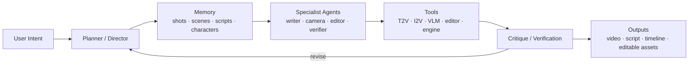

# Awesome Video Agent

<p align="center">
  <b>A curated map of video agents for long-video generation, understanding, editing, and cinematic orchestration.</b>
</p>

<p align="center">
  <a href="./README.md">中文</a> ·
  <a href="./docs/taxonomy.md">Taxonomy</a> ·
  <a href="./docs/reading-roadmap.md">Reading Roadmap</a> ·
  <a href="./docs/paper-index.md">Paper Index</a> ·
  <a href="./docs/proceedings-scan.md">Proceedings Scan</a> ·
  <a href="./docs/zotero-2026-05-26.md">Zotero Import</a> ·
  <a href="./docs/tool-index.md">Tool Index</a> ·
  <a href="./docs/schema.md">Schema</a> ·
  <a href="./docs/stats.md">Stats</a> ·
  <a href="./docs/notes.md">Notes</a> ·
  <a href="./docs/backlog.md">Backlog</a> ·
  <a href="./CONTRIBUTING.md">Contributing</a> ·
  <a href="./CHANGELOG.md">Changelog</a> ·
  <a href="./data/papers.yaml">Paper Data</a>
</p>

<p align="center">
  
  
  
  
</p>

## Overview

Video agents are moving beyond single-prompt clip generation. The new systems are closer to production crews: they plan stories, maintain memories, call tools, verify outputs, revise timelines, and expose cinematic controls.



This repository organizes recent work into eight research routes:

| Route | Core Question | Typical Mechanism |
|---|---|---|
| **Multi-Agent Collaboration** | How can a video task be decomposed like a production pipeline? | Director, writer, storyboard, camera, editor, verifier agents |
| **Video Editing, Compilation, and Production Assets** | How can generated and raw media become searchable, editable, and deliverable assets? | Long-footage decomposition, mashups, trailers, timelines, engine assets |
| **Long-form Reasoning & Memory** | How can agents reason over minutes or hours of video? | Shot / scene / event memory, temporal grounding, narrative graphs |
| **RL & Policy Tuning** | How can agents learn when to search, call tools, revise, or stop? | GRPO, on-policy distillation, dense feedback, tool-use rewards |
| **Cinematic Expression & Domain Expertise** | How can agents understand film grammar and production knowledge? | Camera language, music structure, cultural knowledge, editable timelines |
| **Domain-Specific Video Editing** | How can agents adapt to education, micro-drama, real estate, driving, and other verticals? | Domain knowledge, user feedback, scene-graph edits, vertical toolchains |
| **Evaluation & Self-Improvement** | How can agents critique and improve generated videos? | VLM-as-judge, visual questions, semantic gradients, verifier loops |
| **World Models & Embodied Video Agents** | How can video agents model dynamic worlds and embodied control? | Multi-view generation, scene graphs, navigation control, simulators |

## Coverage

The collection combines local paper summaries from this workspace with a web scan across arXiv, GitHub, and related paper/project pages. Entries are split into two layers:

- **Core Video Agent Papers**: directly about video agents, long-video agents, video generation/editing agents, cinematic compilation, or agentic video workflow.
- **Related Agent Foundations**: not always video-specific, but important for building video agents: tool learning, memory, environment synthesis, orchestration, and long-horizon adaptation.

Current coverage: **67 core video-agent papers/systems + 10 related foundations = 77 papers**, plus **6 open-source systems/tools**.

This update adds a proceedings-focused pass over the last three years and classifies the papers newly added to local Zotero on 2026-05-26. Representative additions include One Sentence, One Drama, ScriptAgent, SciEducator, StoryMem, VideoDirectorGPT, VideoGen-of-Thought, HoloCine, OneStory, InfinityStory, LongLive, Audience in the Loop, PVChat, VBench, ViStoryBench, VideoStudio, and StoryDiffusion. See the [Paper Index](./docs/paper-index.md), [Proceedings Scan](./docs/proceedings-scan.md), [Zotero Classification Log](./docs/zotero-2026-05-26.md), and [Stats](./docs/stats.md) for the full structured list.

## Contents

- [Core Video Agent Papers](#core-video-agent-papers)
- [Related Agent Foundations](#related-agent-foundations)
- [Open-Source Systems and Tools](#open-source-systems-and-tools)
- [Technical Patterns](#technical-patterns)
- [Open Problems](#open-problems)
- [Repository Structure](#repository-structure)
- [Maintenance](#maintenance)

## Core Video Agent Papers

### Multi-Agent Collaboration

| Paper / System | Date | Source | Task | Core Idea | Links |
|---|---|---|---|---|---|
| **Co-Director** | 2026-04 | arXiv preprint | Agentic generative video storytelling | Global narrative optimization and local multimodal self-optimization reduce semantic drift in generative video stories. | [Paper](https://arxiv.org/abs/2604.24842) · [Project](https://co-director-agent.github.io/) |
| **GenMAC** | 2026-03-14 | AAAI 2026 | Compositional text-to-video generation | Design, generation, and redesign agents refine compositional prompts for controllable T2V generation. | [Paper](https://ojs.aaai.org/index.php/AAAI/article/view/37418) · [arXiv](https://arxiv.org/abs/2412.04440) |
| **LASEV** | 2026-02 | arXiv preprint | Educational video generation | Semantic, rule-based, and tool-based critique loops make educational videos more publishable. | [Paper](https://arxiv.org/abs/2602.11790) · [Project](https://robitsg.github.io/LASEV) |
| **ScriptAgent** | 2026-01 | arXiv preprint | Dialogue-to-cinematic video generation | An agentic framework uses scripts as the control interface for long-horizon dialogue-driven cinematic video generation. | [Paper](https://arxiv.org/abs/2601.17737) · [Code](https://github.com/Tencent/digitalhuman/tree/main/ScriptAgent) |
| **VideoGen-of-Thought** | 2025-12 | NeurIPS 2025 Workshop | Step-by-step multi-shot video generation | A thought-style generation pipeline decomposes multi-shot video creation into intermediate planning and generation steps with minimal manual intervention. | [Paper](https://arxiv.org/abs/2412.02259) · [Project](https://cheliosoops.github.io/VGoT/) |
| **MAViS** | 2025-08 | arXiv preprint | Long-sequence video storytelling | Multi-agent storytelling connects narrative planning with T2I, I2V, LoRA, and audio generation. | [Paper](https://arxiv.org/abs/2508.08487) |
| **AniMaker** | 2025-06-12 | SIGGRAPH Asia 2025 | Multi-agent animated storytelling | Director, photography, reviewer, and post-production agents use MCTS-guided candidate clip selection for coherent long-form animation. | [Paper](https://arxiv.org/abs/2506.10540) · [Code](https://github.com/HITsz-TMG/Anim-Director/tree/main/AniMaker) · [Project](https://animaker-dev.github.io/) |
| **MovieAgent** | 2025-03 | arXiv preprint | Automated movie generation | Hierarchical CoT planning decomposes a synopsis into scenes, shots, subtitles, audio, and generated videos. | [Paper](https://arxiv.org/abs/2503.07314) · [Code](https://github.com/showlab/MovieAgent) · [Project](https://weijiawu.github.io/MovieAgent/) |
| **FILMAGENT** | 2025-01 | arXiv preprint | End-to-end virtual film automation | Specialized film-crew agents collaborate through critique, correction, verification, debate, and judging. | [Paper](https://arxiv.org/abs/2501.12909) |
| **StoryAgent** | 2024-11 | arXiv preprint | Customized storytelling video generation | Multi-agent collaboration improves customized story generation and protagonist consistency. | [Paper](https://arxiv.org/abs/2411.04925) |
| **VideoDirectorGPT** | 2024-10 | COLM 2024 | LLM-guided multi-scene video planning | An LLM decomposes text into scene-level plans and video prompts to improve multi-scene consistency in text-to-video generation. | [Paper](https://arxiv.org/abs/2309.15091) · [Project](https://videodirectorgpt.github.io/) |
| **Mora** | 2024-03 | arXiv preprint | Generalist video generation | An early multi-agent visual generation framework for Sora-like generalist video capabilities. | [Paper](https://arxiv.org/abs/2403.13248) · [Code](https://github.com/lichao-sun/Mora) |

### Video Editing, Compilation, and Production Assets

| Paper / System | Date | Source | Task | Core Idea | Links |
|---|---|---|---|---|---|
| **One Sentence, One Drama** | 2026-05-22 | arXiv preprint | Personalized short-form drama generation | A hierarchical multi-agent workflow turns a one-sentence drama idea into story structure, storyboard scripts, assets, constrained first frames, video clips, transitions, and BGM. | [Paper](https://arxiv.org/abs/2605.22144) |
| **Aurora** | 2026-05-18 | arXiv preprint | Unified video editing | A VLM agent translates underspecified user edits into structured plans and reference conditions. | [Paper](https://arxiv.org/abs/2605.18748) · [Code](https://github.com/yeates/Aurora) · [Project](https://yeates.github.io/Aurora-Page) |
| **Cutscene Agent** | 2026-04-28 | arXiv preprint / project page | Editable 3D cutscene generation | Agents control Unreal Engine through MCP tools and output editable Level Sequence assets. | [Project](https://kuaishou-gamemind.github.io/cutscene_agent/) |
| **CineAgents** | 2026-04-12 | arXiv preprint | Instruction-driven cinematic video compilation | Design-and-compose replaces retrieve-and-rank for movie and series compilation. | [Paper](https://arxiv.org/abs/2604.10456) |
| **Sima 1.0** | 2026-04 | arXiv preprint | Documentary video production | A collaborative multi-agent workflow targets documentary production rather than short clip generation. | [Paper](https://arxiv.org/abs/2604.07721) |
| **DIRECT** | 2026-04 | arXiv preprint | Agentic video mashup and trailer editing | Multi-agent editing improves cross-level audio-visual consistency for video mashups and cinematic trailers. | [Paper](https://arxiv.org/abs/2604.04875) · [Code](https://github.com/AK-DREAM/DIRECT) |
| **CutClaw** | 2026-03-31 | arXiv preprint | Hours-long video editing | Bottom-up multimodal decomposition turns raw footage and music into searchable editing units. | [Paper](https://arxiv.org/abs/2603.29664) · [Code](https://github.com/GVCLab/CutClaw) |
| **ComfyUI-Copilot** | 2025 | ACL 2025 System Demonstrations | AIGC workflow automation | Agentic workflow development and node documentation help bridge creative intent and executable media pipelines. | [Paper](https://aclanthology.org/2025.acl-demos.63/) · [Code](https://github.com/AIDC-AI/ComfyUI-Copilot) |

### Long-Video Understanding and Memory

| Paper / System | Date | Source | Task | Core Idea | Links |
|---|---|---|---|---|---|
| **MMProLong** | 2026-05 | arXiv preprint | Long-context VLM training | Long-context VLM recipes are infrastructure for long-video agent memory and reasoning. | [Paper](https://arxiv.org/abs/2605.13831) |
| **OmniScript** | 2026-04-13 | arXiv preprint | Audio-visual script generation | Long-form scripts become a bridge between narrative, scene structure, audio, subtitles, and cinematic video. | [Paper](https://arxiv.org/abs/2604.11102) · [Code](https://github.com/TencentARC/OmniScript) · [Project](https://arcomniscript.github.io) |
| **ProVCA** | 2026-04 | arXiv preprint | Efficient long-video understanding | Progressive video condensation helps agents reason over long videos under limited context budgets. | [Paper](https://arxiv.org/abs/2604.02891) |
| **VideoChat-A1** | 2026-03-14 | AAAI 2026 | Chain-of-shot long video reasoning | An MLLM agent progressively selects relevant shots, splits them into subshots, and reasons coarse-to-fine over long videos. | [Paper](https://ojs.aaai.org/index.php/AAAI/article/view/38018) · [PDF](https://ojs.aaai.org/index.php/AAAI/article/download/38018/41980) · [arXiv](https://arxiv.org/abs/2506.06097) |
| **LongVideoAgent** | 2025-12-23 | ACL 2026 | Long-video question answering | A master agent gathers evidence through grounding and vision agents instead of compressing the whole video at once. | [Paper](https://arxiv.org/abs/2512.20618) · [Code](https://github.com/longvideoagent/LongVideoAgent) · [Project](https://longvideoagent.github.io/) |
| **StoryMem** | 2025-12 | arXiv preprint | Memory-based multi-shot video storytelling | A Memory-to-Video design maintains compact dynamic memory to preserve characters, style, and narrative flow across multi-shot long videos. | [Paper](https://arxiv.org/abs/2512.19539) · [Project](https://kevin-thu.github.io/StoryMem) |
| **VideoARM** | 2025-12 | arXiv preprint | Long-video understanding with hierarchical memory | An observe-think-act-memorize loop reasons over hierarchical multimodal memories for long videos. | [Paper](https://arxiv.org/abs/2512.12360) |
| **OneStory** | 2025-12 | arXiv preprint | Adaptive-memory multi-shot video generation | Adaptive memory helps maintain semantic coherence and visual identity across discontinuous but related video shots. | [Paper](https://arxiv.org/abs/2512.07802) · [Project](https://zhaochongan.github.io/projects/OneStory) |
| **UniVA** | 2025-11 | arXiv preprint | Interactive video agent memory | Global, task, and user memories support consistency across sustained video interactions. | [Paper](https://arxiv.org/abs/2511.08521) · [Code](https://github.com/univa-agent/univa) · [Project](https://univa.online/) |
| **LVAgent** | 2025-10 | ICCV 2025 | Collaborative long video understanding | Multiple MLLM agents are dynamically selected, retrieve key segments, debate answers, and reflect across rounds for long-video QA. | [Paper](https://openaccess.thecvf.com/content/ICCV2025/html/Chen_LVAgent_Long_Video_Understanding_by_Multi-Round_Dynamical_Collaboration_of_MLLM_ICCV_2025_paper.html) · [PDF](https://openaccess.thecvf.com/content/ICCV2025/papers/Chen_LVAgent_Long_Video_Understanding_by_Multi-Round_Dynamical_Collaboration_of_MLLM_ICCV_2025_paper.pdf) · [Code](https://github.com/64327069/LVAgent) |
| **VCA** | 2025-10 | ICCV 2025 | Curiosity-driven long video understanding | A VLM-based agent explores video segments with tree search and self-generated intrinsic rewards to gather the most useful frames. | [Paper](https://openaccess.thecvf.com/content/ICCV2025/html/Yang_VCA_Video_Curious_Agent_for_Long_Video_Understanding_ICCV_2025_paper.html) · [PDF](https://openaccess.thecvf.com/content/ICCV2025/papers/Yang_VCA_Video_Curious_Agent_for_Long_Video_Understanding_ICCV_2025_paper.pdf) |
| **PVChat** | 2025-10 | ICCV 2025 | Personalized video chat | One-shot personalization enables video chat systems to adapt to individual users or identities with minimal examples. | [Paper](https://openaccess.thecvf.com/content/ICCV2025/html/Shi_PVChat_Personalized_Video_Chat_with_One-Shot_Learning_ICCV_2025_paper.html) |
| **MAGNET** | 2025-09-18 | NeurIPS 2025 | Multi-video audio-visual retrieval and reasoning | Specialized agents reason across multiple videos to retrieve, link, and ground relevant audio-visual segments for complex QA. | [Paper](https://openreview.net/forum?id=CwXyUdqFqW) · [Project](https://schowdhury671.github.io/magnet_project/) · [arXiv](https://arxiv.org/abs/2506.07016) |
| **DrVideo** | 2025-06 | CVPR 2025 | Document-retrieval long video understanding | Long videos are converted into coarse text documents and refined through an agent-based retrieval loop that searches for missing evidence. | [Paper](https://openaccess.thecvf.com/content/CVPR2025/html/Ma_DrVideo_Document_Retrieval_Based_Long_Video_Understanding_CVPR_2025_paper.html) · [PDF](https://openaccess.thecvf.com/content/CVPR2025/papers/Ma_DrVideo_Document_Retrieval_Based_Long_Video_Understanding_CVPR_2025_paper.pdf) |
| **OmAgent** | 2024-11 | EMNLP 2024 | Complex video understanding | A divide-and-conquer loop stores and retrieves relevant frames, then dynamically invokes APIs and tools for complex video queries. | [Paper](https://aclanthology.org/2024.emnlp-main.559/) · [PDF](https://aclanthology.org/2024.emnlp-main.559.pdf) |
| **VideoAgent-Memory** | 2024-09 | ECCV 2024 | Memory-augmented video understanding | Structured temporal and object-centric memories let an LLM agent query localization and object tools for long-horizon video reasoning. | [Paper](https://www.ecva.net/papers/eccv_2024/papers_ECCV/html/3241_ECCV_2024_paper.php) · [PDF](https://www.ecva.net/papers/eccv_2024/papers_ECCV/papers/03241.pdf) · [Project](https://videoagent.github.io) |
| **VideoAgent-ECCV2024** | 2024-09 | ECCV 2024 | Long-form video question answering | An LLM agent iteratively identifies and gathers key visual evidence with VLM tools, reducing the need to process every frame. | [Paper](https://www.ecva.net/papers/eccv_2024/papers_ECCV/html/10325_ECCV_2024_paper.php) · [PDF](https://www.ecva.net/papers/eccv_2024/papers_ECCV/papers/10325.pdf) · [Project](https://wxh1996.github.io/VideoAgent-Website/) |

### RL and Policy Tuning

| Paper / System | Date | Source | Task | Core Idea | Links |
|---|---|---|---|---|---|
| **Video-OPD** | 2026-02 | arXiv preprint | Temporal video grounding | On-policy distillation provides dense token-level feedback and reduces the sparse-reward cost of GRPO-style training. | [Paper](https://arxiv.org/abs/2602.02994) |
| **ReAgent-V** | 2025-09-18 | NeurIPS 2025 | Reward-driven video understanding | Real-time reward generation guides frame selection, multi-perspective reflection, and preference/RL-style tuning for video reasoning. | [Paper](https://openreview.net/forum?id=D1Iw4Unvfc) · [arXiv](https://arxiv.org/abs/2506.01300) |

### Evaluation and Self-Improvement

| Paper / System | Date | Source | Task | Core Idea | Links |
|---|---|---|---|---|---|
| **VQQA** | 2026-03 | arXiv preprint | Video generation evaluation and improvement | Visual question generation and VLM critique can act as semantic gradients for iterative video improvement. | [Paper](https://arxiv.org/abs/2603.12310) |
| **ViStoryBench** | 2025-05 | arXiv preprint | Story visualization benchmark | A benchmark suite evaluates story visualization systems on multi-shot narrative consistency and visual storytelling quality. | [Paper](https://arxiv.org/abs/2505.24862) |
| **VideoWebArena** | 2025-01-22 | ICLR 2025 | Video-based web-agent evaluation | A benchmark of web-agent tasks grounded in video tutorials tests whether agents can retain skills and facts from long-context video. | [Paper](https://openreview.net/forum?id=unDQOUah0F) · [Project](https://videowebarena.github.io/) |
| **VBench** | 2024-06 | CVPR 2024 | Video generation benchmark | A hierarchical benchmark decomposes video generation quality into objective dimensions that are useful for evaluating agent-produced videos. | [Paper](https://arxiv.org/abs/2311.17982) · [Project](https://vchitect.github.io/VBench-project/) |

### Cinematic Expression and Domain Expertise

| Paper / System | Date | Source | Task | Core Idea | Links |
|---|---|---|---|---|---|
| **MAVEN** | 2026-05 | arXiv preprint | Multicultural text-to-video generation | Agents add cultural relevance checks and domain knowledge to text-to-video generation. | [Paper](https://arxiv.org/abs/2605.16716) · [Code](https://github.com/AIM-SCU/CRAFT) |
| **Camera Artist** | 2026-04 | arXiv preprint | Cinematic storytelling video generation | Recursive shot generation and cinematic language injection make shot planning more film-like. | [Paper](https://arxiv.org/abs/2604.09195) |
| **AutoMV** | 2025-12 | arXiv preprint | Music video generation | Music structure, lyrics, beat alignment, character consistency, and verifier agents are combined into a full MV pipeline. | [Paper](https://arxiv.org/abs/2512.12196) · [Code](https://github.com/multimodal-art-projection/AutoMV) · [Project](https://m-a-p.ai/AutoMV/) |
| **LangDriveCTRL** | 2025-12 | arXiv preprint | Language-controllable driving scene editing | Multimodal agents translate natural language into scene-graph edits for controllable driving video scenarios. | [Paper](https://arxiv.org/abs/2512.17445) · [Project](https://yunhe24.github.io/langdrivectrl/) |
| **HoloCine** | 2025-10 | arXiv preprint | Cinematic multi-shot long video narratives | A holistic long-video narrative system emphasizes directorial control, shot consistency, and cinematic structure across multi-shot stories. | [Paper](https://arxiv.org/abs/2510.20822) · [Project](https://holo-cine.github.io/) |
| **MotionAgent** | 2025-10 | ICCV 2025 | Fine-grained controllable video generation | A motion field agent parses text into object trajectories and camera extrinsics, then controls image-to-video diffusion with explicit flow. | [Paper](https://openaccess.thecvf.com/content/ICCV2025/html/Liao_MotionAgent_Fine-grained_Controllable_Video_Generation_via_Motion_Field_Agent_ICCV_2025_paper.html) · [PDF](https://openaccess.thecvf.com/content/ICCV2025/papers/Liao_MotionAgent_Fine-grained_Controllable_Video_Generation_via_Motion_Field_Agent_ICCV_2025_paper.pdf) |
| **StoryDiffusion** | 2024-12 | NeurIPS 2024 | Long-range consistent visual story generation | Consistent self-attention improves identity and story consistency across long-range image and video generation. | [Project](https://StoryDiffusion.github.io) |
| **Anim-Director** | 2024-08-19 | SIGGRAPH Asia 2024 | Controllable animation video generation | An LMM-powered animation-making agent turns concise narratives into scripts, scene images, video prompts, and selected animation clips. | [Paper](https://arxiv.org/abs/2408.09787) · [Code](https://github.com/HITsz-TMG/Anim-Director) |
| **DreamStory** | 2024-07 / 2025-08 version | arXiv preprint | Story visualization | LLM-guided diffusion maintains multiple subjects across open-domain visual stories. | [Paper](https://arxiv.org/abs/2407.12899) · [Project](https://dream-xyz.github.io/dreamstory) |
| **VideoStudio** | 2024-01 | arXiv preprint | Consistent-content multi-scene video generation | Multi-scene generation with consistent content provides useful foundations for agentic story and scene planning pipelines. | [Paper](https://arxiv.org/abs/2401.01256) · [Code](https://github.com/FuchenUSTC/VideoStudio) |

### Domain-Specific Video Editing

| Paper / System | Date | Source | Task | Core Idea | Links |
|---|---|---|---|---|---|
| **Audience in the Loop** | 2026-04-13 | CHI 2026 | Viewer-feedback micro-drama production | Audience feedback is brought into micro-drama production loops, offering a human-in-the-loop pattern for iterative short-form video creation. | [Paper](https://arxiv.org/abs/2602.14045) · [DOI](https://doi.org/10.1145/3772318.3790592) |
| **SciEducator** | 2025-11 | arXiv preprint | Scientific video understanding and education | A Deming-cycle multi-agent system combines scientific video understanding, tool use, and iterative educational content refinement. | [Paper](https://arxiv.org/abs/2511.17943) |
| **TheoremExplainAgent** | 2025-07 | ACL 2025 | Long-form theorem explanation video generation | Agentic planning generates multi-minute Manim explanation videos and exposes reasoning flaws that text-only explanations can hide. | [Paper](https://aclanthology.org/2025.acl-long.332/) · [PDF](https://aclanthology.org/2025.acl-long.332.pdf) |
| **AutoMV-RealEstate** | 2025-04-11 | AAAI 2025 Demonstration Track | Real estate marketing video generation | An autonomous agent selects tools, writes story directives, and plans camera trajectories to turn property images into marketing videos. | [Paper](https://ojs.aaai.org/index.php/AAAI/article/view/35377) · [PDF](https://ojs.aaai.org/index.php/AAAI/article/download/35377/37532) |

### World Models and Embodied Video Agents

| Paper / System | Date | Source | Task | Core Idea | Links |
|---|---|---|---|---|---|
| **Action Agent** | 2026-05 | arXiv preprint | Embodied navigation video generation | Agentic navigation video generation is combined with flow-constrained diffusion control. | [Paper](https://arxiv.org/abs/2605.01477) |
| **MultiWorld** | 2026-04 | arXiv preprint | Multi-agent multi-view video world modeling | Multi-agent, multi-view video generation supports consistent visual world modeling. | [Paper](https://arxiv.org/abs/2604.18564) · [Project](https://multi-world.github.io/) |
| **FantasyHSI** | 2026-03-14 | AAAI 2026 | 4D human-scene interaction synthesis | A graph-based multi-agent system coordinates scene navigation and action planning for long-horizon human-scene interaction video synthesis. | [Paper](https://ojs.aaai.org/index.php/AAAI/article/view/37758) |
| **ShareVerse** | 2026-03-03 | arXiv preprint | Shared-world consistent video generation | Multi-agent coordination targets consistency across a shared video world. | [Paper](https://arxiv.org/abs/2603.02697) |
| **InfinityStory** | 2026-03 | arXiv preprint | Unlimited story video generation | World consistency and character-aware shot transitions support unlimited multi-shot video generation beyond short clip horizons. | [Paper](https://arxiv.org/abs/2603.03646) |
| **MoReGen** | 2025-12 | arXiv preprint | Physics-aware text-to-video synthesis | Multi-agent reasoning, physics simulation, and rendering help model physically plausible motion in T2V generation. | [Paper](https://arxiv.org/abs/2512.04221) |
| **Embodied VideoAgent** | 2025-10 | ICCV 2025 | Embodied dynamic scene understanding | Egocentric videos, depth, and pose are fused into persistent scene memory for embodied reasoning, planning, and manipulation tasks. | [Paper](https://openaccess.thecvf.com/content/ICCV2025/html/Fan_Embodied_VideoAgent_Persistent_Memory_from_Egocentric_Videos_and_Embodied_Sensors_ICCV_2025_paper.html) · [PDF](https://openaccess.thecvf.com/content/ICCV2025/papers/Fan_Embodied_VideoAgent_Persistent_Memory_from_Egocentric_Videos_and_Embodied_Sensors_ICCV_2025_paper.pdf) |
| **LongLive** | 2025-09 | arXiv preprint | Real-time interactive long video generation | Interactive prompt switching and long-horizon generation target controllable long videos with smooth transitions and low latency. | [Paper](https://arxiv.org/abs/2509.22622) · [Code](https://github.com/NVlabs/LongLive) |
| **MuMA-ToM** | 2025-04-11 | AAAI 2025 | Multimodal multi-agent theory-of-mind reasoning | Video and text descriptions of embodied multi-agent interactions support reasoning about goals, beliefs, and nested beliefs. | [Paper](https://ojs.aaai.org/index.php/AAAI/article/view/32142) |
| **GROOT** | 2024-01-16 | ICLR 2024 Spotlight | Learning agents from gameplay videos | Reference gameplay videos become goal specifications for an instruction-following agent in open-world environments. | [Paper](https://openreview.net/forum?id=uleDLeiaT3) |

## Related Agent Foundations

| Paper / System | Date | Source | Why It Matters for Video Agents | Links |
|---|---|---|---|---|
| **FutureSim** | 2026-05 | arXiv preprint | Long-horizon event replay is a useful evaluation idea for agents that must adapt over time. | [Paper](https://arxiv.org/abs/2605.15188) · [Project](https://futuresim.github.io) · [Code](https://github.com/futuresim/futuresim) |
| **LLM Agent Memory Survey** | 2026-05 | arXiv preprint | Memory mechanisms are evolving from passive storage toward reusable, experiential agent infrastructure. | [Paper](https://arxiv.org/abs/2605.06716) |
| **Agent-World** | 2026-04-20 | arXiv preprint | Executable environments and verifiable tasks can become scalable training grounds for agent evolution. | [Paper](https://arxiv.org/abs/2604.18292) |
| **OpenClaw-RL** | 2026-03 | arXiv preprint | Real interaction processes can become training signals for agentic tool-use and planning. | [Paper](https://arxiv.org/abs/2603.10165) |
| **Vibe AIGC** | 2026-02-06 | arXiv preprint | Complex media generation should be orchestrated by a meta-planner, specialist agents, tools, and human feedback. | [Paper](https://arxiv.org/abs/2602.04575) |
| **AgentFlow** | 2026-01-26 | ICLR 2026 Oral | Optimizing planner behavior inside the execution flow is relevant to video agents that coordinate many tools. | [Paper](https://openreview.net/forum?id=Mf5AleTUVK) · [arXiv](https://arxiv.org/abs/2510.05592) |
| **AgentKB** | 2025-07 | arXiv preprint | Reusable experience banks can help agents plan and revise across tasks and domains. | [Paper](https://arxiv.org/abs/2507.06229) |
| **ARTIST** | 2025-05 | arXiv preprint | RL can train agents to choose between internal reasoning and external function calls. | [Paper](https://arxiv.org/abs/2505.01441) |
| **ToolRL** | 2025-04-16 | NeurIPS 2025 | Fine-grained rewards can teach reliable tool-use behavior beyond pure SFT imitation. | [Paper](https://papers.nips.cc/paper_files/paper/2025/hash/97c5b2707228e7e3fb67e4ecc2e0e607-Abstract-Conference.html) · [arXiv](https://arxiv.org/abs/2504.13958) · [Code](https://github.com/qiancheng0/ToolRL) |
| **ToRL** | 2025-03-30 | arXiv preprint | Agents need to learn when to reason internally and when to call external tools. | [Paper](https://arxiv.org/abs/2503.23383) |

## Open-Source Systems and Tools

| System | Type | Why It Is Useful | Links |
|---|---|---|---|
| **OpenMontage** | Agentic video production system | Multi-pipeline engineering system with many tools and agent skills for production workflows. | [Code](https://github.com/calesthio/OpenMontage) |
| **video-use** | Coding-agent video editing tool | Lets coding agents edit videos through a programmatic toolchain. | [Code](https://github.com/browser-use/video-use) |
| **ViMax** | Agentic video generation framework | All-in-one workflow with director, screenwriter, producer, and generator roles. | [Code](https://github.com/HKUDS/ViMax) |
| **HKUDS VideoAgent** | All-in-one video agent | Broad framework for video understanding, editing, and remaking; disambiguate from other VideoAgent papers. | [Code](https://github.com/HKUDS/VideoAgent) · [Paper](https://openreview.net/forum?id=cTqGsLYkRl) |
| **Frame.AI** | Shorts / reels segmentation agent | Engineering project for turning long videos into short-form clips. | [Code](https://github.com/dyingpotato890/frame-ai) |
| **veo3-workflow-agents** | Video workflow agents | Prompt enhancement and orchestration around Veo3-style APIs. | [Code](https://github.com/nabobery/veo3-workflow-agents) |

## Technical Patterns

### 1. Crew-Like Role Decomposition

Video agents often copy the division of labor in film and media production:

- **Director / meta-planner**: turns user intent into a production plan.
- **Screenwriter / script agent**: writes dialogue, scene structure, subtitles, and narration.
- **Storyboard / shot agent**: converts scenes into shot-level visual plans.
- **Cinematographer / camera agent**: controls framing, lens, movement, lighting, and composition.
- **Editor / compiler**: retrieves, arranges, and stitches video segments.
- **Reviewer / verifier**: checks narrative logic, temporal consistency, visual quality, rhythm, and instruction following.

### 2. Hierarchical Video Memory

Long-video systems increasingly convert pixels into structured memory:

- frame / clip observations
- shot-level captions and timestamps
- scene-level summaries
- event timelines
- character profiles and relationship graphs
- global, task, and user memories

### 3. Dense Feedback for Video-Agent Policies

Video tasks suffer from sparse, expensive, and subjective final rewards. Useful signals include:

- token-level teacher feedback
- on-policy distillation
- tool-call efficiency rewards
- verifier-guided revision
- execution feedback from engines, editors, or workflow tools

### 4. Cinematic Control Interfaces

Strong systems expose professional controls instead of asking LLMs to directly produce low-level pixels or geometry:

- shot type, camera movement, lens, framing, lighting
- beat, verse, chorus, subtitle, lip-sync timing
- editable engine tracks and timeline assets
- structured conditions for T2V, I2V, video editing, and video DiT models

## Open Problems

- **Intent-to-execution gap**: preserving high-level creative intent through planning, generation, verification, and editing.
- **Long-term consistency**: maintaining characters, spaces, styles, story state, and visual identity across many shots.
- **Reward design**: training agents when video quality is delayed, costly, subjective, and multi-dimensional.
- **Editable generation**: outputting scripts, timelines, scene graphs, engine assets, and workflows instead of opaque videos.
- **Evaluation**: measuring narrative coherence, cinematic language, cultural fidelity, rhythm, and production editability.

## Repository Structure

```text
awesome-video-agent/
├── README.md
├── README.en.md
├── CONTRIBUTING.md
├── CHANGELOG.md
├── CITATION.cff
├── LICENSE
├── Makefile
├── .github/
│   ├── ISSUE_TEMPLATE/
│   ├── workflows/
│   └── pull_request_template.md
├── data/
│   ├── papers.yaml
│   └── tools.yaml
├── docs/
│   ├── paper-index.md
│   ├── proceedings-scan.md
│   ├── zotero-2026-05-26.md
│   ├── backlog.md
│   ├── notes.md
│   ├── reading-roadmap.md
│   ├── schema.md
│   ├── stats.md
│   ├── taxonomy.md
│   └── tool-index.md
└── scripts/
    ├── generate_paper_index.rb
    ├── generate_stats.rb
    ├── generate_tool_index.rb
    └── validate_data.rb
```

## Maintenance

Validate the structured data after edits:

```bash
ruby scripts/validate_data.rb
```

Or use:

```bash
make validate
make generate
make all
```

Regenerate the paper index after changing `data/papers.yaml`:

```bash
ruby scripts/generate_paper_index.rb
```

Regenerate the tool index after changing `data/tools.yaml`:

```bash
ruby scripts/generate_tool_index.rb
```

Regenerate collection statistics:

```bash
ruby scripts/generate_stats.rb
```

## Contributing

Please add new papers to [`data/papers.yaml`](./data/papers.yaml) and place each entry under one or more routes:

- `multi-agent-collaboration`
- `video-editing-compilation`
- `long-form-reasoning-memory`
- `rl-policy-tuning`
- `video-evaluation-self-improvement`
- `cinematic-expression-domain-expertise`
- `video-world-model-embodied`

For each paper, include title, year, task, links, and a one-line takeaway.
