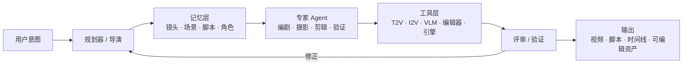

# Awsome Video Agent

<p align="center">
  <b>视频 Agent 论文、系统与技术路线整理：长视频生成、理解、编辑、编排与电影化表达。</b>
</p>

<p align="center">
  <a href="./README.md">English</a> ·
  <a href="./docs/taxonomy.md">技术分类</a> ·
  <a href="./docs/reading-roadmap.md">阅读路线</a> ·
  <a href="./docs/paper-index.md">论文索引</a> ·
  <a href="./docs/tool-index.md">工具索引</a> ·
  <a href="./docs/schema.md">数据格式</a> ·
  <a href="./docs/stats.md">统计</a> ·
  <a href="./docs/notes.md">备注</a> ·
  <a href="./docs/backlog.md">待核对</a> ·
  <a href="./CONTRIBUTING.md">贡献指南</a> ·
  <a href="./CHANGELOG.md">更新日志</a> ·
  <a href="./data/papers.yaml">结构化数据</a>
</p>

<p align="center">
  
  
  
  
</p>

## 项目简介

视频 Agent 正在从“单条 prompt 生成几秒视频”走向“可规划、可记忆、可调用工具、可验证、可迭代”的生产系统。它们不只是让模型生成像素，而是让模型像一个小型剧组一样，完成剧本、分镜、运镜、剪辑、音画同步、反馈修正和资产交付。



本项目按照六条技术路线整理近期视频 Agent 相关论文：

| 技术路线 | 核心问题 | 常见机制 |
|---|---|---|
| **多智能体角色化协作** | 如何像影视工业管线一样拆解复杂视频任务？ | 导演、编剧、分镜、摄影、剪辑、审稿/验证 Agent |
| **长视频分层解构与记忆管理** | 如何理解几十分钟到数小时的视频？ | 镜头/场景/事件记忆、时间定位、叙事图谱、角色档案 |
| **强化学习与策略优化** | Agent 如何学会何时搜索、调用工具、修正或停止？ | GRPO、在线策略蒸馏、稠密反馈、工具调用奖励 |
| **电影语言与领域专长建模** | Agent 如何掌握运镜、节奏、文化、音乐、引擎资产等专业知识？ | 电影语言注入、音乐结构、文化知识、可编辑时间线 |
| **评估与自我改进** | Agent 如何评价并迭代提升生成视频？ | VLM-as-judge、视觉问题、语义梯度、验证器循环 |
| **世界模型与具身视频 Agent** | 视频 Agent 如何建模动态世界和具身控制？ | 多视角生成、场景图、导航控制、仿真器 |

## 收录范围

本项目结合了当前工作区里的论文解读稿，以及针对 arXiv、GitHub 和相关论文/项目页的一轮全网补检索。条目分成两层：

- **核心视频 Agent 论文**：直接面向视频 Agent、长视频理解、视频生成/编辑 Agent、电影剪辑编排、AIGC 视频工作流。
- **相关 Agent 基础设施论文**：不一定直接做视频，但对构建视频 Agent 很关键，例如工具学习、记忆、环境训练、长期适应和编排范式。

当前版本共收录：**32 个核心视频 Agent 条目 + 10 个相关基础设施条目 = 42 篇论文**，另有 **6 个开源系统/工具**。

## 目录

- [核心视频 Agent 论文](#核心视频-agent-论文)
- [相关 Agent 基础设施](#相关-agent-基础设施)
- [开源系统与工具](#开源系统与工具)
- [关键技术模式](#关键技术模式)
- [开放问题](#开放问题)
- [项目结构](#项目结构)
- [维护方式](#维护方式)

## 核心视频 Agent 论文

### 多智能体视频生成

| 论文 / 系统 | 任务 | 核心思想 | 链接 |
|---|---|---|---|
| **FILMAGENT** | 端到端虚拟电影自动化 | 用导演、编剧、演员、摄影师等角色模拟剧组，并通过批评-修正-验证和辩论-裁决减少错误。 | [Paper](https://arxiv.org/abs/2501.12909) |
| **Mora** | 通用视频生成 | 较早的多智能体视觉生成框架，面向 Sora-like 通用视频能力。 | [Paper](https://arxiv.org/abs/2403.13248) · [Code](https://github.com/lichao-sun/Mora) |
| **StoryAgent** | 定制化故事视频生成 | 通过多智能体协作提升定制故事生成和主角一致性。 | [Paper](https://arxiv.org/abs/2411.04925) |
| **GenMAC** | 组合式文生视频 | Design / Generation / Redesign 多 Agent 改写组合式 T2V prompt。 | [Paper](https://arxiv.org/abs/2412.04440) |
| **MovieAgent** | 自动电影/长视频生成 | 用层次化 CoT 将故事梗概和角色库拆成场景、镜头、字幕、音频和视频。 | [Paper](https://arxiv.org/abs/2503.07314) · [Code](https://github.com/showlab/MovieAgent) · [Project](https://weijiawu.github.io/MovieAgent/) |
| **MAViS** | 长序列视频叙事 | 从一句创意出发，串联剧本、分镜、角色建模、关键帧、视频动画和音频生成。 | [Paper](https://arxiv.org/abs/2508.08487) |
| **Camera Artist** | 电影化叙事视频生成 | 在多智能体制片流程中加入递归镜头生成和电影语言注入。 | [Paper](https://arxiv.org/abs/2604.09195) |
| **AutoMV** | 自动音乐视频生成 | 结合音乐结构、歌词、节拍、角色库、视频生成工具和验证 Agent 生成完整 MV。 | [Paper](https://arxiv.org/abs/2512.12196) · [Code](https://github.com/multimodal-art-projection/AutoMV) · [Project](https://m-a-p.ai/AutoMV/) |
| **Co-Director** | Agentic 视频叙事生成 | 用全局叙事优化和局部多模态自优化缓解长视频语义漂移。 | [Paper](https://arxiv.org/abs/2604.24842) · [Project](https://co-director-agent.github.io/) |
| **LASEV** | 教育视频生成 | 用多智能体和语义/规则/工具三类 critique 机制生成可发布教育视频。 | [Paper](https://arxiv.org/abs/2602.11790) · [Project](https://robitsg.github.io/LASEV) |

### 视频编辑、剪辑编排与生产资产

| 论文 / 系统 | 任务 | 核心思想 | 链接 |
|---|---|---|---|
| **CutClaw** | 小时级视频剪辑 | 将原始视频和音乐分层解构为可检索单元，再进行音乐同步剪辑。 | [Paper](https://arxiv.org/abs/2603.29664) · [Code](https://github.com/GVCLab/CutClaw) |
| **CineAgents** | 指令驱动电影/剧集剪辑 | 先建立分层叙事记忆，再按用户指令进行 design-and-compose 式剪辑。 | [Paper](https://arxiv.org/abs/2604.10456) |
| **DIRECT** | 智能体视频混剪 / 预告片编辑 | 用多智能体提升视频 mashup 与预告片中的跨层音画一致性。 | [Paper](https://arxiv.org/abs/2604.04875) · [Code](https://github.com/AK-DREAM/DIRECT) |
| **Cutscene Agent** | 可编辑 3D 过场动画生成 | 让 LLM Agent 通过 MCP 工具操作 Unreal Engine，输出可继续编辑的 Level Sequence。 | [Project](https://kuaishou-gamemind.github.io/cutscene_agent/) |
| **Aurora** | 统一视频编辑 | 由工具增强 VLM Agent 将欠指定编辑请求转成视频 DiT 可用的结构化条件。 | [Paper](https://arxiv.org/abs/2605.18748) · [Code](https://github.com/yeates/Aurora) · [Project](https://yeates.github.io/Aurora-Page) |
| **Sima 1.0** | 纪录片视频生产 | 面向纪录片生产的协作式多智能体工作流。 | [Paper](https://arxiv.org/abs/2604.07721) |
| **ComfyUI-Copilot** | AIGC 工作流自动化 | 为 ComfyUI 提供节点文档、检索、工作流生成和可执行流程开发能力。 | [Paper](https://aclanthology.org/2025.acl-demos.63/) · [Code](https://github.com/AIDC-AI/ComfyUI-Copilot) |

### 长视频理解与记忆

| 论文 / 系统 | 任务 | 核心思想 | 链接 |
|---|---|---|---|
| **LongVideoAgent** | 长视频问答 | Master Agent 反复调用 Grounding Agent 和 Vision Agent 收集证据，再回答问题。 | [Paper](https://arxiv.org/abs/2512.20618) · [Project](https://longvideoagent.github.io/) |
| **OmniScript** | 长影视 Video-to-Script | 将长电影/剧集转为带时间戳的层级化音视频脚本。 | [Paper](https://arxiv.org/abs/2604.11102) · [Code](https://github.com/TencentARC/OmniScript) · [Project](https://arcomniscript.github.io) |
| **Video-OPD** | 视频时序定位 | 用在线策略蒸馏替代稀疏 RL 奖励，提供 token 级稠密教师信号。 | [Paper](https://arxiv.org/abs/2602.02994) |
| **VideoARM** | 分层记忆长视频理解 | 使用 observe-think-act-memorize 循环在分层多模态记忆上推理。 | [Paper](https://arxiv.org/abs/2512.12360) |
| **ProVCA** | 高效长视频理解 | 渐进式视频压缩帮助 Agent 在有限上下文下理解长视频。 | [Paper](https://arxiv.org/abs/2604.02891) |
| **MMProLong** | 长上下文视觉语言模型 | 将 VLM 上下文扩展到 128K 以上，是长视频 Agent 的基础能力之一。 | [Paper](https://arxiv.org/abs/2605.13831) |
| **UniVA** | 通用视频 Agent | Plan-and-Act 双 Agent 结合分层记忆和 MCP 工具服务器，统一理解、编辑、分割和生成。 | [Paper](https://arxiv.org/abs/2511.08521) · [Code](https://github.com/univa-agent/univa) · [Project](https://univa.online/) |

### 评估与自我改进

| 论文 / 系统 | 任务 | 核心思想 | 链接 |
|---|---|---|---|
| **VQQA** | 视频生成评估与改进 | 通过视觉问题生成和 VLM critique，把反馈作为语义梯度迭代提升视频。 | [Paper](https://arxiv.org/abs/2603.12310) |

### 世界、文化与故事一致性

| 论文 / 系统 | 任务 | 核心思想 | 链接 |
|---|---|---|---|
| **MAVEN** | 多文化文生视频 | 让人物、动作、地点 Agent 分别补充文化细节，再由 FuseAgent 合并 prompt。 | [Paper](https://arxiv.org/abs/2605.16716) · [Code](https://github.com/AIM-SCU/CRAFT) |
| **ShareVerse** | 共享世界视频生成 | 用跨智能体注意力保持多个智能体/视角下的视频世界一致性。 | [Paper](https://arxiv.org/abs/2603.02697) |
| **MultiWorld** | 多智能体多视角视频世界模型 | 用多智能体、多视角视频生成支持一致的视觉世界建模。 | [Paper](https://arxiv.org/abs/2604.18564) · [Project](https://multi-world.github.io/) |
| **LangDriveCTRL** | 自然语言可控驾驶场景编辑 | 多模态 Agent 将自然语言转成驾驶视频中的场景图编辑。 | [Paper](https://arxiv.org/abs/2512.17445) · [Project](https://yunhe24.github.io/langdrivectrl/) |
| **Action Agent** | 具身导航视频生成 | 将 agentic navigation video generation 与 flow-constrained diffusion control 结合。 | [Paper](https://arxiv.org/abs/2605.01477) |
| **MoReGen** | 物理感知文生视频 | 多智能体推理、物理模拟器和渲染器帮助生成更合理的运动。 | [Paper](https://arxiv.org/abs/2512.04221) |
| **DreamStory** | 开放域故事可视化 | 用 LLM 引导多主体一致扩散，实现跨画面故事角色一致性。 | [Paper](https://arxiv.org/abs/2407.12899) · [Project](https://dream-xyz.github.io/dreamstory) |

## 相关 Agent 基础设施

| 论文 / 系统 | 对视频 Agent 的意义 | 链接 |
|---|---|---|
| **Vibe AIGC** | 将复杂内容生成定义为智能体编排，而不是一次性 prompt 抽样。 | [Paper](https://arxiv.org/abs/2602.04575) |
| **ToolRL** | 工具调用奖励设计，可迁移到视频工具、剪辑工具和验证工具的调用策略。 | [Paper](https://arxiv.org/abs/2504.13958) · [Code](https://github.com/qiancheng0/ToolRL) |
| **ToRL** | 训练模型判断何时内部推理、何时调用外部工具。 | [Paper](https://arxiv.org/abs/2503.23383) |
| **OpenClaw-RL** | 把真实交互过程变成 Agent 训练信号。 | [Paper](https://arxiv.org/abs/2603.10165) |
| **ARTIST** | 用 RL 学习推理与函数调用的切换。 | [Paper](https://arxiv.org/abs/2505.01441) |
| **AgentFlow** | 优化多步 Agent 系统中的 Planner 行为。 | [Paper](https://arxiv.org/abs/2510.05592) |
| **AgentKB** | 跨领域经验记忆，可用于积累视频编辑/生成经验库。 | [Paper](https://arxiv.org/abs/2507.06229) |
| **LLM Agent Memory Survey** | Agent 记忆机制综述，对设计视频 Agent 的全局/任务/用户记忆有参考价值。 | [Paper](https://arxiv.org/abs/2605.06716) |
| **Agent-World** | 环境合成与可验证任务训练，为视频工具沙箱和可执行环境提供思路。 | [Paper](https://arxiv.org/abs/2604.18292) |
| **FutureSim** | 长周期真实世界事件回放评测，对长期适应型 Agent 有参考意义。 | [Paper](https://arxiv.org/abs/2605.15188) · [Project](https://futuresim.github.io) · [Code](https://github.com/futuresim/futuresim) |

## 开源系统与工具

| 系统 | 类型 | 价值 | 链接 |
|---|---|---|---|
| **OpenMontage** | Agentic video production system | 多 pipeline、多工具、多 agent skill 的开源视频生产系统。 | [Code](https://github.com/calesthio/OpenMontage) |
| **video-use** | Coding-agent video editing tool | 让 coding agents 通过程序化工具链编辑视频。 | [Code](https://github.com/browser-use/video-use) |
| **ViMax** | Agentic video generation framework | 包含导演、编剧、制片、视频生成角色的一体化工作流。 | [Code](https://github.com/HKUDS/ViMax) |
| **HKUDS VideoAgent** | All-in-one video agent | 面向视频理解、编辑、重制的一体化框架；注意与其他 VideoAgent 论文区分。 | [Code](https://github.com/HKUDS/VideoAgent) · [Paper](https://openreview.net/forum?id=cTqGsLYkRl) |
| **Frame.AI** | Shorts / reels segmentation agent | 把长视频切成短视频片段的工程项目。 | [Code](https://github.com/dyingpotato890/frame-ai) |
| **veo3-workflow-agents** | Video workflow agents | 围绕 Veo3 风格 API 的 prompt 增强与生成编排。 | [Code](https://github.com/nabobery/veo3-workflow-agents) |

## 关键技术模式

### 1. 剧组式角色分工

常见角色包括：

- **导演 / 总规划器**：将用户意图转为可执行生产计划。
- **编剧 / 脚本 Agent**：生成剧情、对白、字幕、旁白和场景结构。
- **分镜 / 镜头 Agent**：把场景转成 shot-level 视觉计划。
- **摄影 / 运镜 Agent**：控制景别、镜头运动、构图、光照、焦段。
- **剪辑 / 编排 Agent**：检索、排序、拼接视频片段。
- **审稿 / 验证 Agent**：检查叙事逻辑、时序一致性、视觉质量、节奏和指令遵循。

### 2. 分层视频记忆

长视频 Agent 越来越依赖结构化记忆：

- 帧/片段观察
- 镜头级 caption 和时间戳
- 场景级摘要
- 事件时间线
- 角色档案和关系图谱
- 全局、任务、用户三层记忆

### 3. 面向 Agent 策略的稠密反馈

视频任务的最终奖励通常稀疏、昂贵且主观，因此需要更细粒度的训练信号：

- token 级教师反馈
- on-policy distillation
- 工具调用效率奖励
- verifier 引导的修正
- 来自引擎、编辑器、工作流工具的执行反馈

### 4. 电影化控制接口

成熟系统不会让 LLM 直接输出低层像素或 3D 坐标，而是提供专业语义接口：

- 景别、机位、运镜、焦段、构图、光照
- 节拍、主歌、副歌、字幕、唇形同步时间
- 可编辑引擎轨道和时间线资产
- T2V / I2V / 视频编辑 / Video DiT 的结构化条件

## 开放问题

- **意图-执行鸿沟**：如何让抽象创作意图稳定落到剧本、镜头、模型条件和后期编辑。
- **长期一致性**：如何在多镜头、多场景中保持角色、空间、风格和叙事状态。
- **奖励设计**：如何训练视频 Agent，因为最终视频质量昂贵、主观、延迟且多维。
- **可编辑生成**：如何输出脚本、时间线、场景图、引擎资产和工作流，而不只是黑盒视频。
- **评估体系**：如何衡量叙事连贯性、电影语言、文化准确性、节奏和生产可编辑性。

## 项目结构

```text
awsome-video-agent/
├── README.md
├── README.zh-CN.md
├── CONTRIBUTING.md
├── CHANGELOG.md
├── CITATION.cff
├── LICENSE
├── Makefile
├── .github/
│   ├── ISSUE_TEMPLATE/
│   ├── workflows/
│   └── pull_request_template.md
├── data/
│   ├── papers.yaml
│   └── tools.yaml
├── docs/
│   ├── paper-index.md
│   ├── backlog.md
│   ├── notes.md
│   ├── reading-roadmap.md
│   ├── schema.md
│   ├── stats.md
│   ├── taxonomy.md
│   └── tool-index.md
└── scripts/
    ├── generate_paper_index.rb
    ├── generate_stats.rb
    ├── generate_tool_index.rb
    └── validate_data.rb
```

## 维护方式

新增或修改结构化数据后，可以运行：

```bash
ruby scripts/validate_data.rb
```

也可以直接用：

```bash
make validate
make generate
make all
```

修改 `data/papers.yaml` 后，可以重新生成论文索引：

```bash
ruby scripts/generate_paper_index.rb
```

修改 `data/tools.yaml` 后，可以重新生成工具索引：

```bash
ruby scripts/generate_tool_index.rb
```

重新生成统计页：

```bash
ruby scripts/generate_stats.rb
```
