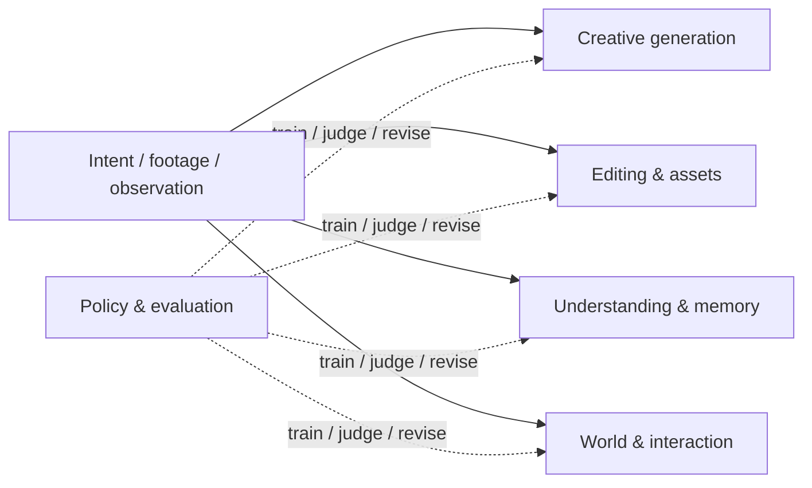

# Video Agent Taxonomy

This repository uses five primary routes. A paper is placed according to its **main delivered capability**, not every technique it uses. Multi-agent roles, cinematic vocabulary, domain knowledge, memory, and verifier loops may appear across several routes.

## Classification Rules

| If the system primarily... | Place it under... |
|---|---|
| turns an idea, script, music track, or domain brief into new narrative video | Creative Generation and Production Orchestration |
| transforms existing footage or returns an editable production artifact | Video Editing, Recomposition, and Editable Assets |
| inspects video to answer, retrieve, ground, summarize, or sustain dialogue | Long-Video Understanding, Retrieval, and Memory |
| trains policies or benchmarks/critiques agent and video quality | Policy Learning, Evaluation, and Self-Improvement |
| models an actionable dynamic world or embodied interaction through video | World Modeling, Interaction, and Embodied Control |

For ambiguous work, the output decides the primary category. For example, `StoryMem` uses memory but generates multi-shot stories, so it is a creative generation paper; `CutClaw` understands footage as an intermediate step but delivers edits, so it is an editing paper.

## 1. Creative Generation and Production Orchestration

**Scope**: systems whose central product is newly generated video or a complete creative production workflow, from concept or script through shots, sound, and delivery.

This route absorbs the former top-level buckets for multi-agent film crews, cinematic expression, and vertical creative applications. Those ideas remain important, but they describe *how* creative generation works rather than a distinct output type.

**Representative systems**

- **FILMAGENT**, **MovieAgent**, **AniMaker**, and **ScriptAgent**: director-like planning and production pipelines.
- **Camera Artist**, **HoloCine**, and **VideoDirectorGPT**: shot planning and cinematic control.
- **AutoMV**, **TheoremExplainAgent**, **AutoMV-RealEstate**, and **SciEducator**: music, education, and marketing requirements inside generation workflows.
- **StoryMem**, **OneStory**, and **InfinityStory**: memory or world consistency used to generate multi-shot stories.

**Key bottleneck**: converting high-level intent into consistent scripts, shots, characters, audio, and controlled generation over many scenes.

## 2. Video Editing, Recomposition, and Editable Assets

**Scope**: systems that operate on source footage or generate editable downstream artifacts such as timelines, masks, workflow graphs, or game-engine sequences.

**Representative systems**

- **CutClaw**: editing hours-long raw material through multimodal decomposition.
- **CineAgents** and **DIRECT**: compilation, mashup, and trailer editing.
- **Aurora** and **LangDriveCTRL**: instruction-driven editing or scene modification.
- **Cutscene Agent** and **ComfyUI-Copilot**: editable engine or workflow assets.

**Key bottleneck**: preserving user intent while producing precise, inspectable edits rather than only a rendered video.

## 3. Long-Video Understanding, Retrieval, and Memory

**Scope**: systems whose output is understanding: evidence retrieval, temporal grounding, question answering, summarization, or persistent conversation over video.

**Representative systems**

- **LongVideoAgent**, **LVAgent**, **VideoChat-A1**, and **VCA**: agentic evidence search for long-video reasoning.
- **VideoAgent-Memory**, **VideoARM**, and **UniVA**: temporal or hierarchical memories.
- **DrVideo**, **MAGNET**, and **PVChat**: document-like retrieval, multi-video reasoning, and personalized video chat.

**Key bottleneck**: turning continuous video and audio streams into compact, retrievable evidence without losing temporal context.

## 4. Policy Learning, Evaluation, and Self-Improvement

**Scope**: training signals, policy optimization, tool-use behavior, critique loops, and evaluation suites. Training and evaluation are grouped because both answer how an agent becomes reliable rather than what media product it delivers.

**Representative systems**

- **Video-OPD** and **ReAgent-V**: video-specific dense feedback and reward-driven reasoning.
- **VQQA**, **VBench**, and **ViStoryBench**: critique or benchmarks for generated video and narrative quality.
- **ToolRL**, **ToRL**, **ARTIST**, and **AgentFlow**: general tool-use and planner optimization applicable to video agents.

**Key bottleneck**: assigning credit to planning, retrieval, tool calls, synthesis, edits, and verification when final video quality is expensive and subjective.

## 5. World Modeling, Interaction, and Embodied Control

**Scope**: systems for actionable dynamic environments: spatial consistency, physics, multi-view worlds, egocentric memory, interactive generation, navigation, or control.

**Representative systems**

- **ShareVerse** and **MultiWorld**: consistent multi-agent or multi-view video worlds.
- **Embodied VideoAgent** and **GROOT**: video memory or demonstrations used for embodied action.
- **Action Agent**, **FantasyHSI**, **MoReGen**, and **LongLive**: navigation, interaction, physical motion, and real-time controllable worlds.

**Key bottleneck**: maintaining spatial and causal consistency while video changes in response to actions.

## Cross-Cutting Mechanisms

These are intentionally not primary categories:

- **Role-based multi-agent collaboration**: can organize generation, editing, understanding, or embodied control.
- **Cinematic language and domain expertise**: specialize a creative or editing system for music, education, marketing, culture, or driving.
- **Memory**: is a primary outcome only for understanding systems; in creative systems it is a consistency mechanism.
- **Critique and verification**: belong in the policy/evaluation route only when training or evaluation is the main contribution.

## Compact View

